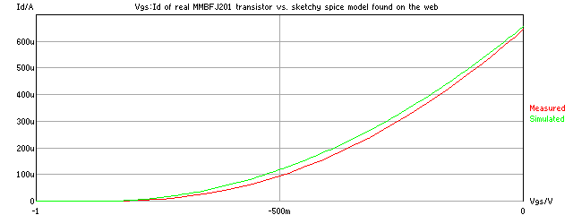
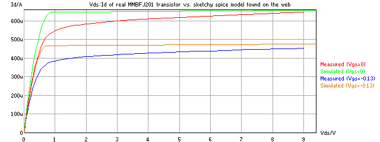
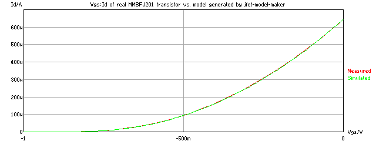
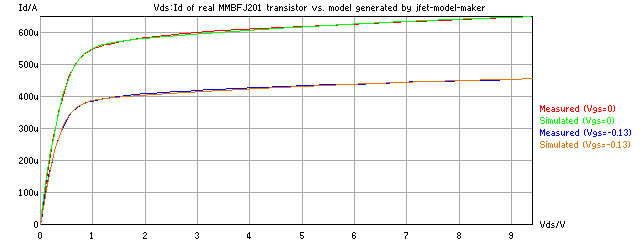
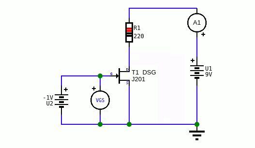
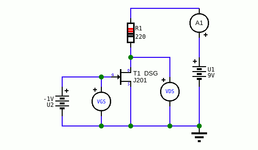
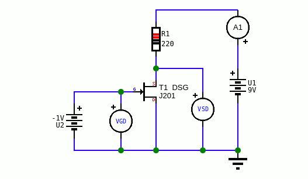
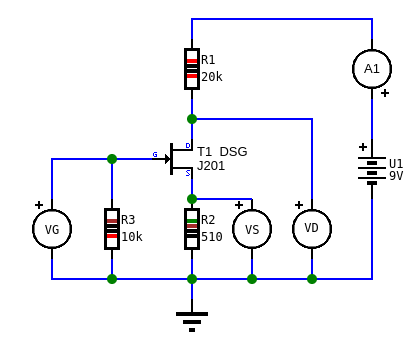

# jfet-model-maker

Create accurate JFET level 2 spice models from measured transistor curves

# Why?

You probably have a 200MB folder full of sketchy spice models you found somewhere on the internet. These models were made decades ago by unknown people,
from unknown samples made by no longer used manufacturing processes, using unknown measuring methods. Copied, pasted, modified by numerous 
other individuals who came along. They no longer represent the reality.

Here are Vgs:Id and Vds:Id charts of measured MMBFJ201 transistor (red) and simulated data (green) of spice model of MMBFJ201 
that I found on some sketchy website (yes I adjusted Vto and beta, without it it would be even worse):

And here is my model generated with jfet-model-maker:

# How to use it

In the [data](data/) folder are few measured transistors. Each curve is in separate CSV file. 
Measure your transistor, then in the [config.json](config.json) change transistor name to match yours.
Run the jfet-model-maker.ngjs script and in few minutes you will have first decent model which is saved in tmp.json file. 
Press Ctrl+C to interrupt the script and you will be asked if you want to save the tmp.json file, press "y" to save.
You can then let it run for few hours to further improve accuracy. The above model of MMBFJ201 was made in 2 hours or so.
Some transistors may take longer, even days.

When tmp.json is saved you can run gif.ngjs script to generate gifs with charts and spice code.

JFET model maker uses [ngspicejs v0.2](https://github.com/dvhx/ngspicejs) for simulation.

# Measuring Vgs:Id curves

Set U1 to 9V. Use ammeter A1 to measure drain current.
Change gate voltage U2 from -6 to 0 (you can even go to positive as long you don't exceed transistor ratings).
Use voltmeter to measure Vgs.

# Measuring Vgd:Is curves

Almost exactly same as previous but source and drain are swapped.
Ammeter A1 now measures source current.
Voltmeter measures Vgd.

# Measuring Vds:Id curves

Gate voltage will be constant (e.g. 0 or -100mV or -300mV) and you will be changing battery voltage from 0 to 9V.
Ammeter A1 will measure drain current and voltmeter will measure Vds.

# Measuring Vsd:Is curves

Similar to previous but drain and source are swapped.
Gate voltage will be constant (e.g. 0 or -100mV or -300mV) and you will be changing battery voltage from 0 to 9V.
Ammeter A1 will measure source current and voltmeter will measure Vsd.

# Measuring DC JIG values

This measurement is called "dc jig" and it consists of battery and 3 random resistors. In 4 measurements that I made I chose these values: 
(Rd=20k, Rg=10k, Rs=510), (Rd=10k, Rg=10k, Rs=510), (Rd=10k, Rg=10k, Rs=2k), (Rd=10k, Rg=10k, Rs=100). Thus creating 4 csv files.
Ammeter measures drain current. Vg measures gate voltage, Vd measures drain voltage, Vs measures source voltage.

# Score weights

Transistor data directory contains "files.json" file which contains filenames of the curves and their relative score weights, for example:

    {
        "vgs_id_0.csv": 1,
        "vgd_is_0.csv": 0,
        "vds_id_vgs_0.csv": 1,
        "vds_id_vgs_1.csv": 10,
        "vds_id_vgs_2.csv": 0,
        "vsd_is_vgd_0.csv": 1,
        "vsd_is_vgd_1.csv": 0,
        "dc_jig_1.csv": 2,
        "dc_jig_2.csv": 2,
        "dc_jig_3.csv": 2,
        "dc_jig_4.csv": 2
    }

Default weight is 1, use 0 if you don't want to use that curve. If the curve is worse than other curves, increase the weight and 
re-run the jfet-model-maker script.

# AC parameters

I don't have gear to accurately measure AC parameters so I left them at their default ngspice values. 
Once the model is done you can use for example datasheet values for capacitances.
Or you can make some new simulation methods and calculate score from real and simulated values.

# Support

You can support development on [Patreon](https://www.patreon.com/DusanHalicky) or you can hire me via [Upwork](https://www.upwork.com/freelancers/~013b4c3d6e772fdb01)

