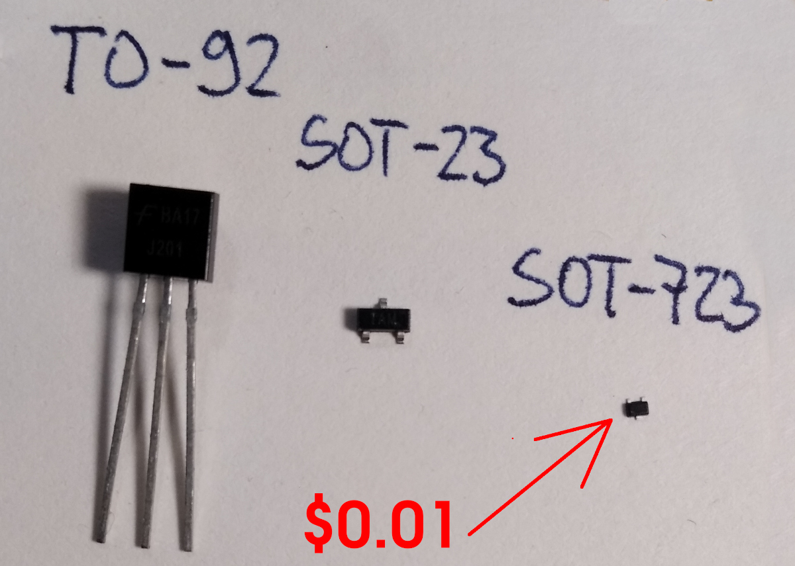
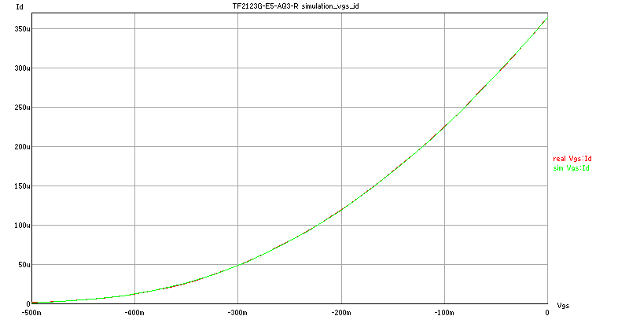
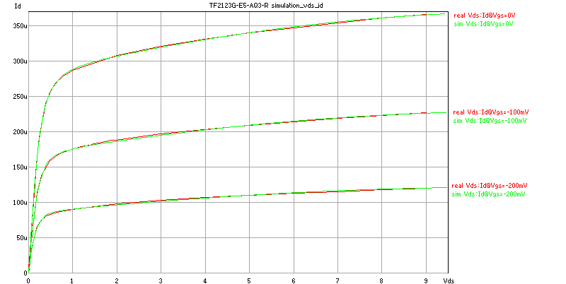
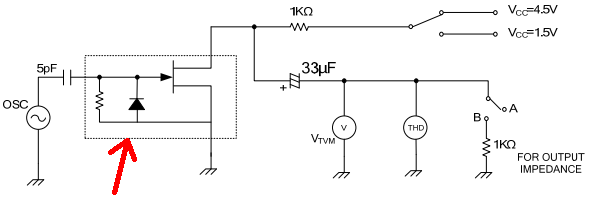
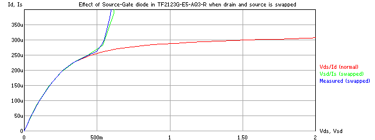
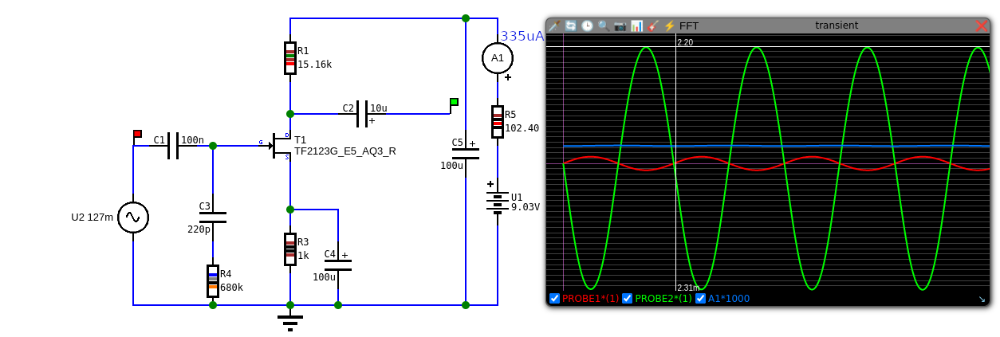
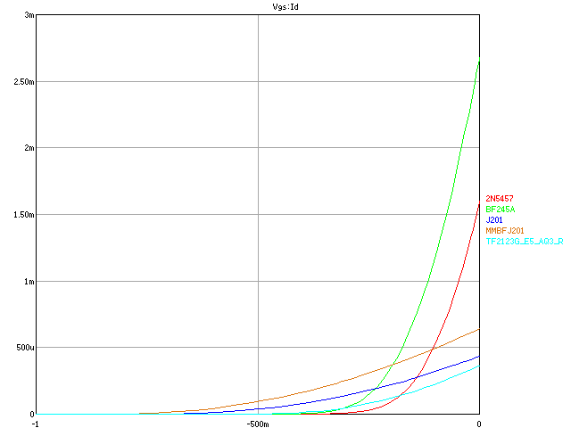
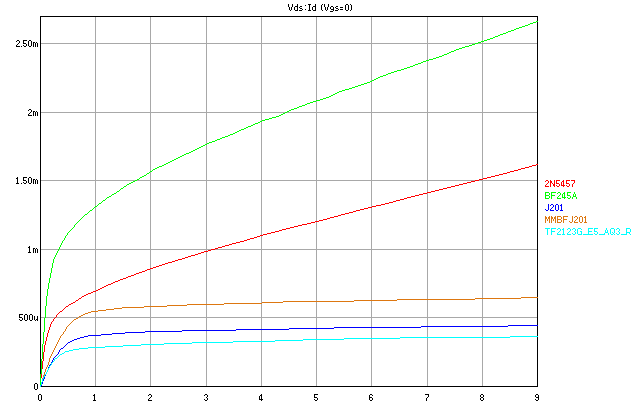

### $0.01 JFET (TF2123G-E5-AQ3-R)

TF2123G-E5-AQ3-R ([datasheet](https://www.unisonic.com.tw/uploadfiles/836/part_no_pdf/TF2123.pdf), [LCSC](https://www.lcsc.com/product-detail/JFETs_UTC-Unisonic-Tech-TF2123G-E5-AQ3-R_C127046.html?s_z=n_TF2123G-E5-AQ3-R))
is a $0.01 JFET from Unisonic Technologies (Taiwan) mainly for capacitive (electret?) microphones applications. 
It is in extremely small and annoying SOT-723 package with E5 marking on it:

I measured it's curves and created spice model for it (ngspice, ngspicejs) which corelates very well with the measured data, here is
comparison of real measured data (red) and simulation (green):

As seen in the datasheet, this transistor has built in resistor and diode from source to gate:

Because it has this built-in source-gate diode it cannot be correctly measured in reverse (drain and source swapped), 
the diode opens and current rises rapidly, so I used normal data (grounded source) for both normal and swapped mode, 
and then added diode and 16M resistor (this was measured using ohmmeter).
Again simulation and real data corelates very closely, but you shouldn't be using it in swapped configuration because it will not work
very well as amplifier. The red line in normal mode (source on ground). The green is simulation of swapped mode (drain on ground) and
blue is real measured data.

Here is actual spice model:

    .subckt QTF2123G_E5_AQ3_R_FULL d g s
    J_J1 d g s JMOD1
    D_D1 s g DMOD1
    R_R1 s g 16000000
    .model JMOD1 NJF(level=2 beta=0.0015218551373374477 is=3.242812961068422e-12 vto=-0.46211899441556936
      +delta=10.593692303268101 ibd=6.274140933932065e-14 lambda=0.02795532198575133 lfgam=0.0050831513139119
      +lfg1=0.0009883171407377136 lfg2=0.0003885589878250989 mvst=0.5769699295008569 mxi=0.0000015354594023650526
      +n=28.23578450441741 p=2.3485782042625196 q=2.152420967568266 rd=0.20699669276291183 rs=0.03316826991492417
      +vbd=98.70378358277105 vbi=1.429234546265391 vst=0.010494378450143846 xi=1.2478110145177965
      +z=41.471367507655266 acgam=0 cds=0 cgd=0 cgs=0 fc=0.5 hfeta=0 hfe1=0 hfe2=0 hfgam=0 hfg1=0
      +hfg2=0 taud=0 taug=0 xc=0 af=1 kf=0)
    .model DMOD1 D(is=1.38738e-10 n=1.73917 rs=0.0043279 cjo=4e-12 vj=0.6 tt=6e-9 m=0.45 bv=100)
    .ends

Once I had the model I made simple common source amplifier and optimized it to find maximal possible gain, which was with Rd=15k:

Measured and simulated results:

    Real:       Vin=0.254Vpp Vout=4.525Vpp Gain=17.8x I=326uA
    Simulation: Vin=0.254Vpp Vout=4.57Vpp  Gain=17.9x I=335uA

So it is reasonable accurate. And here is comparison with other JFETs:

### Conclusion ###

- cheapest available JFET costing only $0.01
- built in 16M resistor and a diode (which means source and drain are not interchangable)
- it has very small package which is annoying
- SPICE model was found and is accurate

